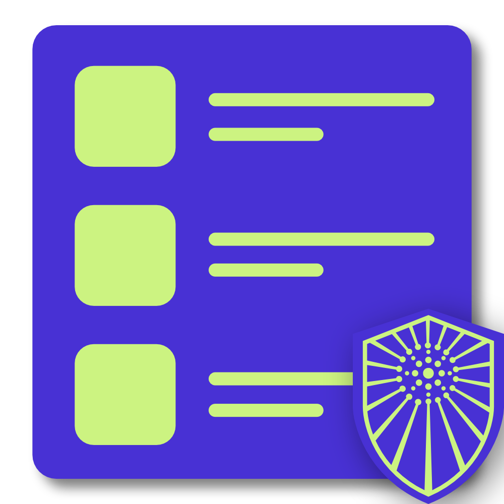

<div align="center">

| DONATE                                                                                                                                                                         | CORE                                                                                                                 |
| ------------------------------------------------------------------------------------------------------------------------------------------------------------------------------ | -------------------------------------------------------------------------------------------------------------------- |
| [](https://www.buymeacoffee.com/carlowisse) |  |
| [](https://paypal.me/cjwisse?country.x=AU&locale.x=en_AU)                 |                    |

</div>

<!-- PROJECT LOGO -->
<br />
<div align="center">
  <a href="https://github.com/carlowisse/sentinel-lists">
    
  </a>

  <h1 style="text-align: center; font-weight: 600; letter-spacing: 2px; border-bottom: none;">SENTINEL <span style="font-weight: 900;">LISTS</span></h1>

  <p style="text-align: center; font-size: 18px;">
    A collection of curated and cleaned domains and regular expressions for use with Pi-Hole.
    <br />
    <a href="./lists/domains">Domains</a>&nbsp; &#183; &nbsp;
    <a href="./lists/regexes">Regexes</a>&nbsp;
  </p>
</div>

<br>

## Getting Started
**Sentinel Lists requires Git LFS to clone**

A few of the compiled lists are very large and therefore require Git LFS. **It is not necessary to clone this repository** unless you would like to make edits (see below for contributing instructions), you can simply link to the RAW files hosted on GitHub if you wish to use them.

<br>

## How To Clone
> You will need **Git LFS**

1. Download & Install [Git LFS](https://git-lfs.github.com/)
2. Set up Git LFS for your user
    ```
    git lfs install
    ```
    > **You only need to do this once per user account**
3. Now you can clone or fork the repo
    ```
    git clone https://github.com/carlowisse/sentinel-lists.git
    ```

<br>

## Contributing
Contributions are what make the open source community such an amazing place to learn, inspire, and create. Any contributions you make are **greatly appreciated**.

If you have a suggestion that would make this better, please fork the repo and create a pull request. You can also simply open an issue with the tag `enhancement`.

1. Fork the Project
2. Create your Feature Branch (`git checkout -b feature/amazing-feature`)
3. Commit your Changes (`git commit -m 'Added an amazing feature'`)
4. Push to the Branch (`git push origin feature/amazing-feature`)
5. Open a Pull Request

<br>

## Issues
If there are any issues with domains, regexes or scripts, please raise an issue on the issue tab and I will look into it. This includes lists that might be missing domains that you think are needed to deny a service or ads.

If you have found or created an awesome domains list, please raise an issue and paste it in that issue, I will look into adding it!

<br>

## License
Distributed under the MIT License. See [LICENSE](LICENSE.txt) for more information.

<br>

## Contact
Carlo Wisse - [Twitter](https://twitter.com/carlowisse) - [Email](mailto:contact@carlowisse.com)

<br>

## Acknowledgments
* [Choose an Open Source License](https://choosealicense.com)
